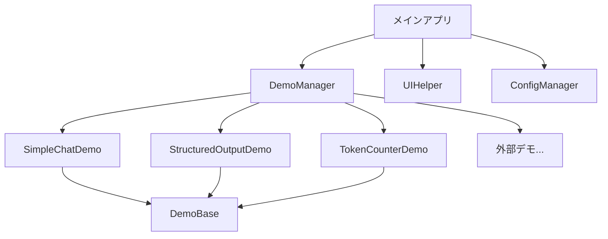

# 🚀 a10_00_openai_skeleton.py 詳細設計書

## 🌟 全体概要

OpenAI Responses API学習用のスケルトンプログラムです。各種デモ機能を提供し、新しい機能を簡単に追加できる拡張可能なアーキテクチャを採用しています。

| 項目 | 内容 |
|------|------|
| **目的** | OpenAI API学習用デモアプリケーション |
| **フレームワーク** | Streamlit |
| **対応API** | OpenAI Responses API |
| **実行方法** | `streamlit run a10_00_openai_skeleton.py --server.port=8501` |
| **アーキテクチャ** | デモ機能の動的読み込み対応 |

### 🏗️ システム構成



---

## 🎭 1. デモ実装クラス

### 💬 1.1 SimpleChatDemo

> **概要：** シンプルなチャット機能のデモクラス

| 基本情報 | 詳細 |
|----------|------|
| **継承元** | DemoBase |
| **機能** | 基本的なチャット機能 |
| **API呼び出し** | responses.create |
| **UI** | チャット入力・メッセージ表示 |

#### 📋 主要メソッド

| メソッド | 引数 | 戻り値 | 説明 |
|----------|------|--------|------|
| `run()` | - | - | メイン処理実行 |

#### 🔄 処理フロー

| ステップ | 処理内容 |
|----------|----------|
| 1 | UI設定（setup_ui） |
| 2 | チャット入力受付 |
| 3 | ユーザーメッセージ追加 |
| 4 | API呼び出し |
| 5 | レスポンス処理・表示 |
| 6 | メッセージ履歴表示 |

#### 💡 実装例

```python
def run(self):
    self.setup_ui()

    user_input = st.chat_input("メッセージを入力してください")

    if user_input:
        self.add_user_message(user_input)
        messages = self.message_manager.get_messages()
        response = self.call_api(messages)

        texts = ResponseProcessor.extract_text(response)
        if texts:
            self.add_assistant_message(texts[0])
        st.rerun()

    self.display_messages()
```

---

### 📊 1.2 StructuredOutputDemo

> **概要：** 構造化出力（JSON形式）のデモクラス

| 基本情報 | 詳細 |
|----------|------|
| **継承元** | DemoBase |
| **機能** | JSON形式での構造化応答 |
| **対応タスク** | レビュー分析、要約、感情分析 |
| **response_format** | json_object |

#### 📋 対応タスク

| タスク | プロンプト内容 | 出力形式 |
|--------|----------------|----------|
| **商品レビューの分析** | 評価・良い点・改善点の分析 | `{評価: 1-5, 良い点: [], 改善点: []}` |
| **テキストの要約** | タイトル・要点・結論の抽出 | `{タイトル: "", 要点: [], 結論: ""}` |
| **感情分析** | 感情タイプ・強度・理由の分析 | `{感情: "", 強度: 0-1, 理由: ""}` |

#### 🔄 処理フロー

| ステップ | 処理内容 |
|----------|----------|
| 1 | UI設定・タスク選択 |
| 2 | テキスト入力フォーム |
| 3 | プロンプト構築 |
| 4 | API呼び出し（response_format指定） |
| 5 | JSON解析・表示 |
| 6 | メッセージ履歴表示 |

#### 💡 主要機能

```python
# JSON形式での応答取得
response = self.call_api(
    messages,
    response_format={"type": "json_object"}
)

# JSON解析・表示
try:
    result = json.loads(texts[0])
    st.json(result)
except:
    pass
```

---

### 🔢 1.3 TokenCounterDemo

> **概要：** トークン数計算・コスト推定のデモクラス

| 基本情報 | 詳細 |
|----------|------|
| **継承元** | DemoBase |
| **機能** | トークン数計算、コスト推定、テキスト切り詰め |
| **表示項目** | トークン数、使用率、推定コスト |
| **追加機能** | テキスト切り詰め機能 |

#### 📋 表示メトリクス

| メトリクス | 計算方法 | 表示形式 |
|------------|----------|----------|
| **トークン数** | TokenManager.count_tokens() | `{count:,}` |
| **推定合計トークン** | 入力 + 出力推定（50%） | `{total:,}` |
| **推定コスト** | TokenManager.estimate_cost() | `${cost:.6f}` |
| **使用率** | (使用/最大) × 100 | `{percent:.1f}%` |

#### 🎯 主要機能

| 機能 | 説明 | UI要素 |
|------|------|--------|
| **トークン計算** | リアルタイム計算 | メトリクス表示 |
| **使用率表示** | プログレスバー | 視覚的表示 |
| **テキスト切り詰め** | 指定トークン数で切り詰め | 数値入力+ボタン |
| **モデル制限表示** | 最大トークン数表示 | キャプション |

#### 💡 実装例

```python
# トークン数計算
token_count = TokenManager.count_tokens(text, self.model)
output_tokens = token_count // 2
cost = TokenManager.estimate_cost(token_count, output_tokens, self.model)

# メトリクス表示
col1, col2, col3 = st.columns(3)
with col1:
    st.metric("トークン数", f"{token_count:,}")
with col2:
    st.metric("推定合計トークン", f"{total_tokens:,}")
with col3:
    st.metric("推定コスト", f"${cost:.6f}")

# テキスト切り詰め
truncated = TokenManager.truncate_text(text, max_tokens, self.model)
```

---

## 🎛️ 2. 管理クラス

### 🗂️ 2.1 DemoManager

> **概要：** デモアプリケーションの管理クラス

| 基本情報 | 詳細 |
|----------|------|
| **役割** | デモの読み込み・管理・実行 |
| **動的読み込み** | `demos/`ディレクトリから自動読み込み |
| **カテゴリ管理** | 設定ファイルベースのカテゴリ分け |
| **エラーハンドリング** | 読み込み失敗時の適切な処理 |

#### 📋 主要メソッド

| メソッド | 引数 | 戻り値 | 説明 |
|----------|------|--------|------|
| `__init__()` | - | - | デモの初期化・読み込み |
| `_load_demos()` | - | `Dict[str, DemoBase]` | デモクラスの読み込み |
| `get_demo_categories()` | - | `List[Dict[str, List[str]]]` | カテゴリ情報取得 |
| `run_demo()` | `demo_name: str` | - | 指定デモの実行 |

#### 🗂️ デモ読み込み仕様

| 項目 | 仕様 |
|------|------|
| **内蔵デモ** | 直接クラス定義 |
| **外部デモ** | `demos/demo_*.py` パターン |
| **継承チェック** | DemoBaseを継承したクラスのみ |
| **エラー処理** | 読み込み失敗時の警告表示 |

#### 💡 動的読み込み機能

```python
# 外部デモの動的読み込み
demos_dir = Path("demos")
if demos_dir.exists():
    for demo_file in demos_dir.glob("*.py"):
        if demo_file.stem.startswith("demo_"):
            try:
                module_name = f"demos.{demo_file.stem}"
                module = importlib.import_module(module_name)

                # DemoBaseを継承したクラスを探す
                for attr_name in dir(module):
                    attr = getattr(module, attr_name)
                    if (isinstance(attr, type) and
                        issubclass(attr, DemoBase) and
                        attr != DemoBase):
                        demo_name = attr_name.lower().replace("demo", "")
                        demos[demo_name] = attr(demo_name)
            except Exception as e:
                st.error(f"デモの読み込みエラー ({demo_file}): {e}")
```

---

## 🎮 3. メインアプリケーション

### 🏛️ 3.1 OpenAISkeletonApp

> **概要：** メインアプリケーションクラス

| 基本情報 | 詳細 |
|----------|------|
| **役割** | アプリケーション全体の制御 |
| **UI管理** | ページ設定、サイドバー、メインコンテンツ |
| **セッション管理** | selected_demoの状態管理 |
| **ナビゲーション** | デモ間の遷移制御 |

#### 📋 主要メソッド

| メソッド | 引数 | 戻り値 | 説明 |
|----------|------|--------|------|
| `__init__()` | - | - | 初期化処理 |
| `run()` | - | - | アプリケーション実行 |
| `_create_sidebar_menu()` | - | - | サイドバーメニュー作成 |
| `_show_welcome_page()` | - | - | ウェルカムページ表示 |
| `_show_footer()` | - | - | フッター表示 |

#### 🎨 UI構成

| 領域 | 内容 | 機能 |
|------|------|------|
| **ヘッダー** | タイトル・ページ設定 | UIHelper.init_page() |
| **サイドバー** | デモ選択メニュー | カテゴリ別デモリスト |
| **メインエリア** | デモ実行 / ウェルカムページ | 動的コンテンツ表示 |
| **フッター** | バージョン情報・デバッグ | サイドバー下部 |

#### 🗂️ サイドバーメニュー構成

| 要素 | 説明 |
|------|------|
| **カテゴリヘッダー** | 設定ファイルから取得 |
| **デモボタン** | カテゴリ内のデモリスト |
| **セパレーター** | 視覚的区切り |
| **ホームボタン** | ウェルカムページに戻る |

#### 🏠 ウェルカムページ機能

| セクション | 内容 |
|------------|------|
| **タイトル** | アプリケーション名・説明 |
| **デモカテゴリ** | 利用可能なデモの一覧表示 |
| **使い方** | 操作方法・設定説明（展開可能） |

#### 💡 セッション状態管理

```python
def _init_session_state(self):
    if 'selected_demo' not in st.session_state:
        st.session_state.selected_demo = None

# デモ選択処理
if st.sidebar.button(demo_title, key=f"select_{demo_name}"):
    st.session_state.selected_demo = demo_name
    st.rerun()
```

---

## ⚙️ 4. 設定管理

### 📄 4.1 config.yaml 連携

| 設定項目 | 説明 | 例 |
|----------|------|-----|
| **app.demo_categories** | デモカテゴリ定義 | 基本機能、応用機能 |
| **app.demo_titles** | デモ表示名 | simple_chat: "シンプルチャット" |
| **experimental.debug_mode** | デバッグモード | true/false |

#### 📊 デモカテゴリ設定例

```yaml
app:
  demo_categories:
    - name: "基本機能"
      demos: ["simple_chat", "token_counter"]
    - name: "応用機能"
      demos: ["structured_output"]

  demo_titles:
    simple_chat: "シンプルチャット"
    structured_output: "構造化出力"
    token_counter: "トークンカウンター"

experimental:
  debug_mode: false
```

---

## 🔌 5. エントリーポイント

### 🚀 5.1 main関数

> **概要：** アプリケーションのエントリーポイント

| 項目 | 詳細 |
|------|------|
| **デコレータ** | @error_handler |
| **処理** | OpenAISkeletonApp の初期化・実行 |
| **エラーハンドリング** | グローバルエラー処理 |

```python
@error_handler
def main():
    app = OpenAISkeletonApp()
    app.run()

if __name__ == "__main__":
    main()
```

---

## 📁 6. ディレクトリ構成

### 🗂️ プロジェクト構造

```
project/
├── a10_00_openai_skeleton.py    # メインアプリケーション
├── helper.py                    # ヘルパーモジュール
├── config.yaml                  # 設定ファイル
├── demos/                       # 外部デモディレクトリ
│   ├── demo_advanced_chat.py    # 拡張チャットデモ
│   ├── demo_image_analysis.py   # 画像分析デモ
│   └── demo_voice_chat.py       # 音声チャットデモ
├── logs/                        # ログディレクトリ
└── requirements.txt             # 依存関係
```

### 📦 外部デモ作成方法

| ステップ | 内容 |
|----------|------|
| 1 | `demos/demo_*.py` ファイル作成 |
| 2 | DemoBaseを継承したクラス定義 |
| 3 | `run()` メソッド実装 |
| 4 | アプリケーション再起動で自動読み込み |

#### 💡 外部デモ例

```python
# demos/demo_example.py
from helper import DemoBase
import streamlit as st

class ExampleDemo(DemoBase):
    def run(self):
        self.setup_ui()
        st.info("これは外部デモの例です")

        if st.button("テスト"):
            self.add_user_message("テストメッセージ")
            # API処理...

        self.display_messages()
```

---

## 🔧 7. 実行・設定

### 🚀 7.1 実行方法

| 方法 | コマンド |
|------|---------|
| **標準実行** | `streamlit run a10_00_openai_skeleton.py` |
| **ポート指定** | `streamlit run a10_00_openai_skeleton.py --server.port=8501` |

### 🔑 7.2 環境設定

| 項目 | 設定方法 |
|------|----------|
| **OpenAI API Key** | 環境変数 `OPENAI_API_KEY` |
| **設定ファイル** | `config.yaml` の編集 |
| **依存関係** | `pip install streamlit openai tiktoken pyyaml` |

### 🐛 7.3 デバッグ機能

| 機能 | 説明 | 有効化方法 |
|------|------|------------|
| **デバッグモード** | セッションステート表示 | config.yaml: `experimental.debug_mode: true` |
| **パフォーマンス監視** | 実行時間記録 | helper.py の @timer デコレータ |
| **エラー詳細表示** | 例外情報表示 | 自動的に有効 |

---

## 📈 8. 拡張方法

### 🔨 8.1 新しいデモの追加

| ステップ | 説明 |
|----------|------|
| **1. クラス作成** | DemoBaseを継承したクラス定義 |
| **2. run()実装** | メイン処理の実装 |
| **3. 配置** | 直接追加 or `demos/` ディレクトリ |
| **4. 設定更新** | config.yaml のカテゴリ・タイトル設定 |

### 🎯 8.2 実装パターン

#### 基本パターン

```python
class NewDemo(DemoBase):
    def run(self):
        self.setup_ui()  # 共通UI設定

        # カスタムUI
        user_input = st.text_input("入力")

        if st.button("実行"):
            self.add_user_message(user_input)
            messages = self.message_manager.get_messages()
            response = self.call_api(messages)

            texts = ResponseProcessor.extract_text(response)
            if texts:
                self.add_assistant_message(texts[0])

        self.display_messages()
```

#### 高度なパターン

```python
class AdvancedDemo(DemoBase):
    def run(self):
        self.setup_ui()

        # タブ分け
        tab1, tab2 = st.tabs(["メイン", "設定"])

        with tab1:
            # メイン機能
            self._main_functionality()

        with tab2:
            # 設定画面
            self._settings_panel()

        self.display_messages()

    def _main_functionality(self):
        # メイン機能の実装
        pass

    def _settings_panel(self):
        # 設定パネルの実装
        pass
```

---

## 🎉 総合使用例

### 💬 完全なチャットアプリケーション

```python
# 実行
streamlit run a10_00_openai_skeleton.py --server.port=8501

# 1. ブラウザでアクセス: http://localhost:8501
# 2. サイドバーから "シンプルチャット" を選択
# 3. チャット入力でメッセージを送信
# 4. AIからの応答を確認
# 5. 他のデモも試してみる
```

このスケルトンプログラムにより、OpenAI Responses APIの学習が体系的に行えます。新しい機能の追加も簡単で、拡張性の高いアーキテクチャとなっています。🚀