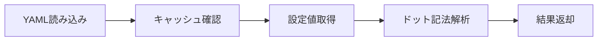
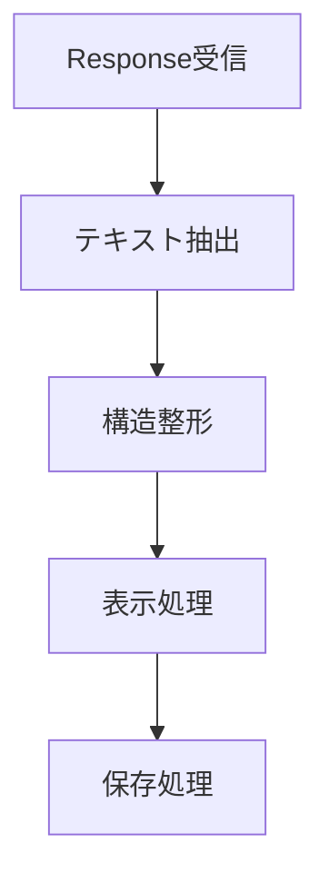

# 📚 helper.py 詳細仕様書

## 🌟 全体概要

OpenAI API学習用Streamlitアプリケーションのヘルパーモジュールです。設定管理、メッセージ処理、UI構築、レスポンス処理などの共通機能を提供します。

| 項目 | 内容 |
|------|------|
| **対応API** | OpenAI Responses API |
| **フレームワーク** | Streamlit |
| **主要機能** | 設定管理、メッセージ管理、UI構築、トークン計算、レスポンス処理 |
| **対応モデル** | GPT-4o, GPT-4o-mini, O1, O3, O4シリーズ等 |

---

## 🏗️ 1. クラス

### 🔧 1.1 ConfigManager

> **概要：** YAML設定ファイルの読み込み・管理クラス

| 基本情報 | 詳細 |
|----------|------|
| **用途** | 設定ファイル管理 |
| **キャッシュ** | 対応 |
| **設定形式** | YAML |
| **階層アクセス** | ドット記法対応 |

#### 📋 主要メソッド

| メソッド | 引数 | 戻り値 | 説明 |
|----------|------|--------|------|
| `__init__()` | `config_path: str` | - | 初期化 |
| `get()` | `key: str, default: Any` | `Any` | 設定値取得 |
| `reload()` | - | - | 設定再読み込み |

#### 🔄 処理フロー



#### 💡 使用例

```python
# 設定取得
config = ConfigManager()
model = config.get("models.default", "gpt-4o-mini")
timeout = config.get("api.timeout", 30)
```

---

### 💬 1.2 MessageManager

> **概要：** OpenAI Responses API用メッセージ履歴管理クラス

| 基本情報 | 詳細 |
|----------|------|
| **対応ロール** | user, assistant, system, developer |
| **ストレージ** | Streamlit SessionState |
| **制限機能** | メッセージ数制限対応 |
| **エクスポート** | JSON形式対応 |

#### 📋 主要メソッド

| メソッド | 引数 | 戻り値 | 説明 |
|----------|------|--------|------|
| `add_message()` | `role: RoleType, content: str` | - | メッセージ追加 |
| `get_messages()` | - | `List[EasyInputMessageParam]` | メッセージ取得 |
| `clear_messages()` | - | - | 履歴クリア |
| `export_messages()` | - | `Dict[str, Any]` | エクスポート |
| `import_messages()` | `data: Dict[str, Any]` | - | インポート |

#### 🎯 ロール型定義

| ロール | 用途 | 使用API |
|--------|------|---------|
| `user` | ユーザーメッセージ | 共通 |
| `assistant` | AI応答 | 共通 |
| `system` | システムプロンプト | ChatCompletions |
| `developer` | 開発者指示 | Responses |

#### 💡 使用例

```python
# メッセージ管理
manager = MessageManager("chat_history")
manager.add_message("user", "こんにちは")
messages = manager.get_messages()
```

---

### 🔢 1.3 TokenManager

> **概要：** トークン数計算・管理クラス

| 基本情報 | 詳細 |
|----------|------|
| **エンコーディング** | cl100k_base |
| **対応モデル** | GPT-4o系, O1系, O3系, O4系 |
| **機能** | トークン計算、コスト推定、制限確認 |
| **ライブラリ** | tiktoken |

#### 📋 主要メソッド

| メソッド | 引数 | 戻り値 | 説明 |
|----------|------|--------|------|
| `count_tokens()` | `text: str, model: str` | `int` | トークン数計算 |
| `truncate_text()` | `text: str, max_tokens: int, model: str` | `str` | テキスト切り詰め |
| `estimate_cost()` | `input_tokens: int, output_tokens: int, model: str` | `float` | コスト推定 |
| `get_model_limits()` | `model: str` | `Dict[str, int]` | モデル制限取得 |

#### 🏷️ サポートモデル

| モデル系統 | 最大入力 | 最大出力 | 特徴 |
|------------|----------|----------|------|
| **GPT-4o** | 128K | 4K | 標準モデル |
| **GPT-4o-mini** | 128K | 4K | 軽量・高速 |
| **O1系** | 128K | 32K-64K | 推論特化 |
| **O3系** | 200K | 100K | 高性能推論 |
| **O4系** | 256K | 128K | 最新世代 |

#### 💡 使用例

```python
# トークン管理
tokens = TokenManager.count_tokens("テスト文章", "gpt-4o-mini")
cost = TokenManager.estimate_cost(1000, 500, "gpt-4o-mini")
limits = TokenManager.get_model_limits("gpt-4o")
```

---

### 🎨 1.4 UIHelper

> **概要：** Streamlit UI構築用ヘルパークラス

| 基本情報 | 詳細 |
|----------|------|
| **対象** | Streamlit UI |
| **提供機能** | ページ初期化、モデル選択、表示機能 |
| **対応モデル種別** | テキスト、音声合成、音声認識 |

#### 📋 ページ・基本UI

| メソッド | 引数 | 戻り値 | 説明 |
|----------|------|--------|------|
| `init_page()` | `title: str, sidebar_title: str` | - | ページ初期化 |
| `create_tabs()` | `tab_names: List[str], key: str` | `List[Any]` | タブ作成 |
| `create_columns()` | `spec: List[Union[int, float]], gap: str` | `List[Any]` | カラム作成 |
| `show_metrics()` | `metrics: Dict[str, Any], columns: int` | - | メトリクス表示 |

#### 📋 モデル選択UI

| メソッド | 対象 | カテゴリ | 戻り値 |
|----------|------|----------|--------|
| `select_model()` | テキスト生成 | standard, reasoning | `str` |
| `select_speech_model()` | 音声合成 | tts, audio_chat, reasoning | `str` |
| `select_whisper_model()` | 音声認識 | whisper, transcribe, audio_chat | `str` |

#### 📋 表示・情報UI

| メソッド | 引数 | 機能 |
|----------|------|------|
| `display_messages()` | `messages: List, show_system: bool` | メッセージ履歴表示 |
| `show_token_info()` | `text: str, model: str` | トークン情報表示 |
| `create_download_button()` | `data: Any, filename: str` | ダウンロードボタン |

#### 🎵 音声モデル対応

| カテゴリ | モデル例 | 用途 |
|----------|----------|------|
| **TTS** | tts-1, tts-1-hd | 音声合成専用 |
| **音声対話** | gpt-4o-audio-preview | リアルタイム対話 |
| **音声認識** | whisper-1 | 転写・翻訳 |

#### 💡 使用例

```python
# UI構築
UIHelper.init_page("デモアプリ")
model = UIHelper.select_model("model_key", "reasoning")
UIHelper.show_token_info("テキスト", model)
```

---

### 📤 1.5 ResponseProcessor

> **概要：** OpenAI Responses APIレスポンス処理クラス

| 基本情報 | 詳細 |
|----------|------|
| **対応API** | OpenAI Responses API |
| **処理機能** | テキスト抽出、整形、表示、保存 |
| **出力形式** | JSON、Streamlit表示 |

#### 📋 主要メソッド

| メソッド | 引数 | 戻り値 | 説明 |
|----------|------|--------|------|
| `extract_text()` | `response: Response` | `List[str]` | テキスト抽出 |
| `format_response()` | `response: Response` | `Dict[str, Any]` | レスポンス整形 |
| `display_response()` | `response: Response, show_details: bool` | - | Streamlit表示 |
| `save_response()` | `response: Response, filename: str` | `str` | ファイル保存 |

#### 🔄 処理フロー



#### 💡 使用例

```python
# レスポンス処理
texts = ResponseProcessor.extract_text(response)
ResponseProcessor.display_response(response, show_details=True)
filepath = ResponseProcessor.save_response(response)
```

---

### 🏛️ 1.6 DemoBase

> **概要：** デモアプリケーションの抽象基底クラス

| 基本情報 | 詳細 |
|----------|------|
| **継承方式** | 抽象基底クラス |
| **共通機能** | UI設定、メッセージ管理、API呼び出し |
| **必須実装** | `run()` メソッド |

#### 📋 主要メソッド

| メソッド | 種別 | 引数 | 説明 |
|----------|------|------|------|
| `run()` | 抽象 | - | メイン処理（要実装） |
| `setup_ui()` | 実装済み | - | 共通UI設定 |
| `call_api()` | 実装済み | `messages: List, **kwargs` | API呼び出し |
| `add_user_message()` | 実装済み | `content: str` | ユーザーメッセージ追加 |
| `add_assistant_message()` | 実装済み | `content: str` | アシスタントメッセージ追加 |

#### 🎯 実装例

```python
class ChatDemo(DemoBase):
    def run(self):
        self.setup_ui()

        if prompt := st.chat_input("入力"):
            self.add_user_message(prompt)
            messages = self.message_manager.get_messages()
            response = self.call_api(messages)

            if response:
                texts = ResponseProcessor.extract_text(response)
                self.add_assistant_message(texts[0])

        self.display_messages()
```

---

## 🏷️ 2. 型定義

### 📝 2.1 RoleType

| 項目 | 内容 |
|------|------|
| **定義** | `Literal["user", "assistant", "system", "developer"]` |
| **用途** | メッセージロールの型安全性確保 |
| **対応API** | OpenAI Chat Completions / Responses |

```python
RoleType = Literal["user", "assistant", "system", "developer"]
```

---

## 🎭 3. デコレータ

### 🛡️ 3.1 error_handler

| 項目 | 内容 |
|------|------|
| **用途** | エラーハンドリング |
| **表示** | Streamlitエラー表示 |
| **ログ** | 自動ログ出力 |
| **デバッグ** | 詳細エラー表示対応 |

### ⏱️ 3.2 timer

| 項目 | 内容 |
|------|------|
| **用途** | 実行時間計測 |
| **記録** | SessionStateに保存 |
| **監視** | パフォーマンス監視 |
| **ログ** | 実行時間ログ出力 |

### 💾 3.3 cache_result

| 項目 | 内容 |
|------|------|
| **用途** | 結果キャッシュ |
| **TTL** | 時間制限対応 |
| **制限** | サイズ制限管理 |
| **キー** | MD5ハッシュ使用 |

#### 💡 デコレータ使用例

```python
@error_handler
@timer
@cache_result(ttl=3600)
def expensive_function():
    # 時間のかかる処理
    return result
```

---

## 🔧 4. ユーティリティ

### 📋 汎用関数一覧

| 関数 | 引数 | 戻り値 | 用途 |
|------|------|--------|------|
| `sanitize_key()` | `name: str` | `str` | Streamlit key文字列化 |
| `load_json_file()` | `filepath: str` | `Optional[Dict]` | JSONファイル読み込み |
| `save_json_file()` | `data: Dict, filepath: str` | `bool` | JSONファイル保存 |
| `format_timestamp()` | `timestamp: Union[int, float, str]` | `str` | タイムスタンプ整形 |
| `create_session_id()` | - | `str` | セッションID生成 |

#### 🔄 処理詳細

| 関数 | 処理内容 |
|------|----------|
| **sanitize_key** | 正規表現 `[^0-9a-zA-Z_]` → `_` + 小文字変換 |
| **load_json_file** | ファイル読み込み → JSON解析 → エラーハンドリング |
| **save_json_file** | ディレクトリ作成 → JSON書き込み → 成功/失敗判定 |
| **format_timestamp** | 型判定 → datetime変換 → `%Y-%m-%d %H:%M:%S` 形式 |
| **create_session_id** | 時刻+オブジェクトID → MD5ハッシュ → 8文字切り出し |

---

## 🔄 5. 後方互換性

### 📋 互換関数一覧

| 関数 | 委譲先 | 用途 |
|------|--------|------|
| `init_page()` | `UIHelper.init_page()` | ページ初期化 |
| `select_model()` | `UIHelper.select_model()` | モデル選択 |
| `get_default_messages()` | `MessageManager.get_default_messages()` | デフォルトメッセージ |
| `extract_text_from_response()` | `ResponseProcessor.extract_text()` | テキスト抽出 |

### 🎯 特殊互換関数

#### `append_user_message()`

| 引数 | 型 | 説明 |
|------|-----|------|
| `append_text` | `str` | 追加テキスト |
| `image_url` | `Optional[str]` | 画像URL |

**戻り値：** `List[EasyInputMessageParam]`

**処理：** マルチモーダル対応メッセージ作成

---

## 🚀 総合使用例

### 💬 チャットアプリケーション

```python
from helper import DemoBase, UIHelper, ResponseProcessor

class ChatApp(DemoBase):
    def __init__(self):
        super().__init__("chat_app", "AIチャット")

    def run(self):
        # UI設定
        self.setup_ui()

        # チャット入力
        if prompt := st.chat_input("メッセージを入力してください"):
            # ユーザーメッセージ追加
            self.add_user_message(prompt)

            # API呼び出し
            messages = self.message_manager.get_messages()
            response = self.call_api(messages, max_tokens=1000)

            # レスポンス処理
            if response:
                texts = ResponseProcessor.extract_text(response)
                if texts:
                    self.add_assistant_message(texts[0])
                    ResponseProcessor.display_response(response)

        # メッセージ履歴表示
        self.display_messages()

# アプリケーション実行
if __name__ == "__main__":
    app = ChatApp()
    app.run()
```

### 🎵 音声対応アプリケーション

```python
# 音声合成機能付きチャット
speech_model = UIHelper.select_speech_model("speech_key", "tts")
whisper_model = UIHelper.select_whisper_model("whisper_key", "whisper")

# 音声ファイルアップロード
audio_file = st.file_uploader("音声ファイル", type=['mp3', 'wav'])
if audio_file:
    # 音声認識処理
    transcription = openai_client.audio.transcriptions.create(
        model=whisper_model,
        file=audio_file
    )
    st.write(f"認識結果: {transcription.text}")
```

---

## 📊 設定ファイル例（config.yaml）

```yaml
models:
  default: "gpt-4o-mini"
  available:
    - "gpt-4o"
    - "gpt-4o-mini"
    - "gpt-4.1"
    - "o1"
    - "o3-mini"

api:
  timeout: 30
  max_retries: 3

ui:
  page_title: "OpenAI API Demo"
  layout: "wide"
  message_display_limit: 50

model_pricing:
  gpt-4o-mini:
    input: 0.00015
    output: 0.0006
  gpt-4o:
    input: 0.005
    output: 0.015

cache:
  enabled: true
  ttl: 3600
  max_size: 100
```

このhepler.pyモジュールにより、OpenAI APIを使用したStreamlitアプリケーションの開発が効率的に行えます。🎉